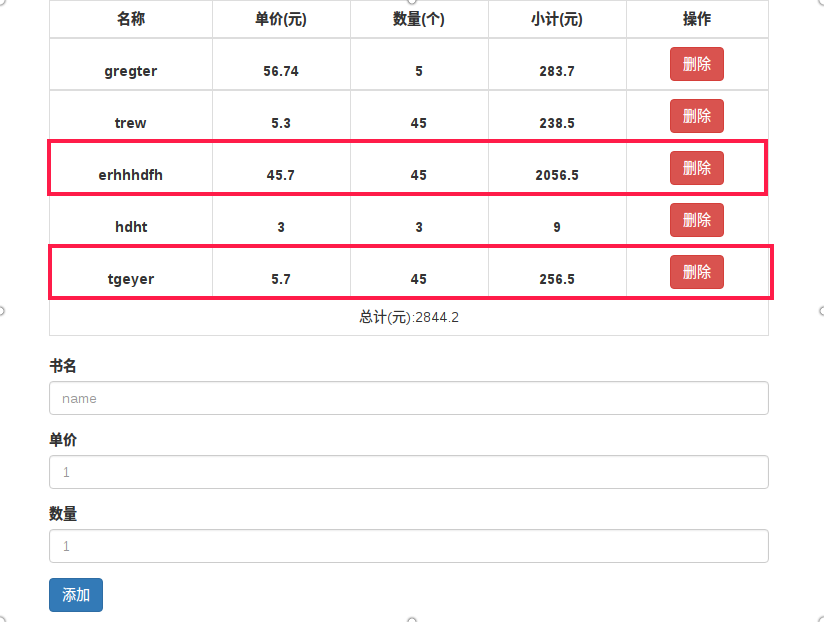
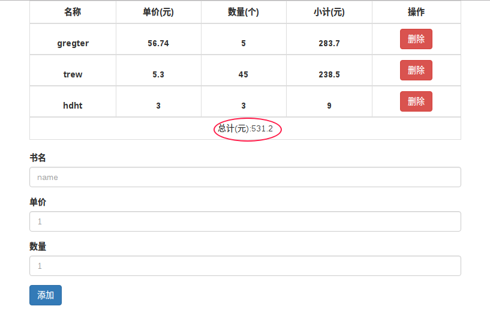

### 这是用react实现的一个类似于购物车的简单的一些动态功能
这里面主要实现的功能：

- 首先是首次加载的结构


- 三项全部填好后，点击添加。账单里有添加上的信息，小计、总计功能实现



- 点击删除按钮(删掉上图选框的项)，实现表格删除，以及总计的动态变化



## 说明：

1)利用react实现这些动态变化还是比较基础的，本着**一个思想**：凡是要动态变化的值，我都会根据state去设置。

2)注意在删除的时候，利用数组的splice()方法，不可使用索引值，因为根据索引删掉的可能会导致结果不同步。必须给每一项一个独一无二的值.
我利用**id=Date.now()**

### 3)我写的时候想了很长时间的一点
那就是在实现总计功能时。

我的想法是这样的：

    总计=每个小计相加，所以我首先得拿到每个对象数组里面Uall(小计)的值，**所以我要使用map().**返回每个小计的值后,我发现问题来了，我该如何相加。jsx里面是不可以写js语句的，我就各种return,绑定方法什么的都没法实现效果，于是我想到了**reduce()**或许可以实现.正好map()返回的是数组,直接就可以用reduce().

#### 两个点map+reduce，get到以后代码就如下了：

```js
<td colSpan="5">总计(元):
    {this.state.data.map(item =>item.id===0 ?''
    : item.Uall).reduce((prev,cur) =>
    parseFloat(prev + cur))
    }
</td>
```

4)使用了h5新增的 input type='number'，这里我min设置了它的最小值为1，设置这个后它只允许输入整数，于是又写了step，设置为两位小数
```js
<input type="number" min="1" step='0.01'/>
```
---
其他大家就看代码吧，我全都写在一个组件里了(App.js)，因为东西不是很多，而且一个组件拿数据的时候比较方便。有些细节没有考虑到的后续再添加～
